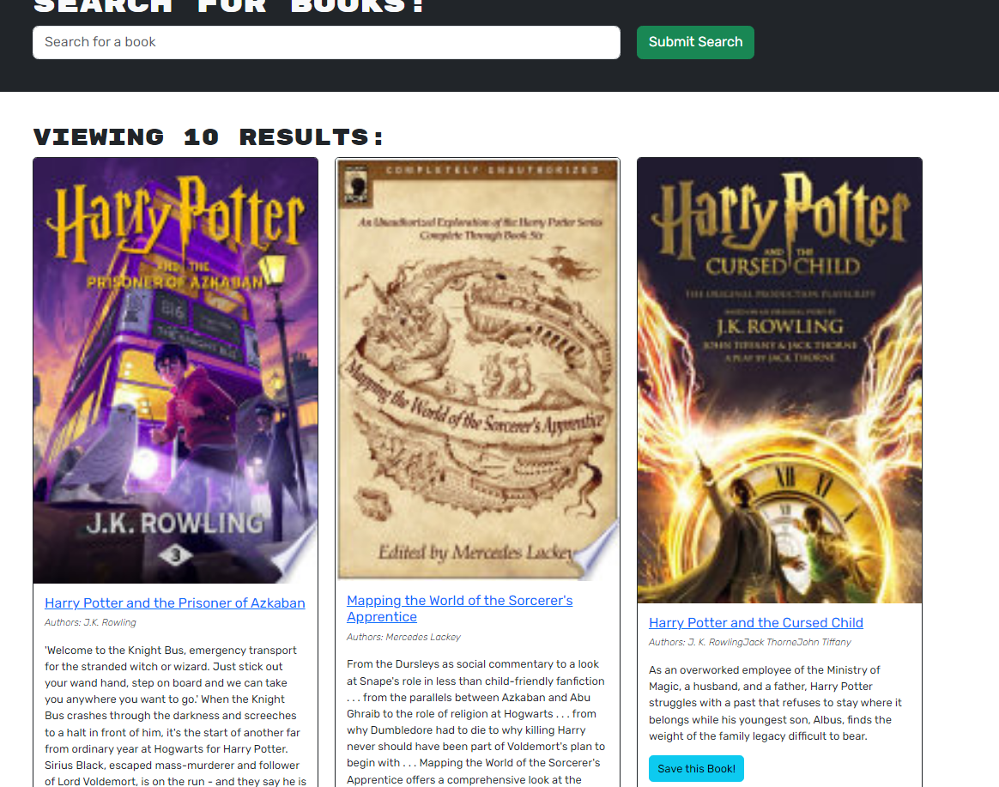
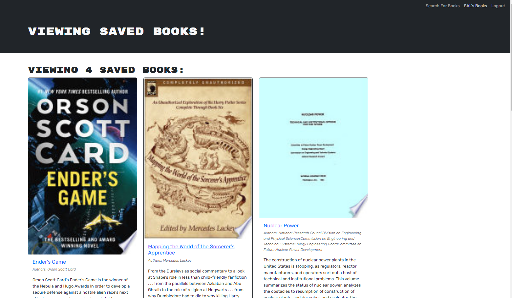
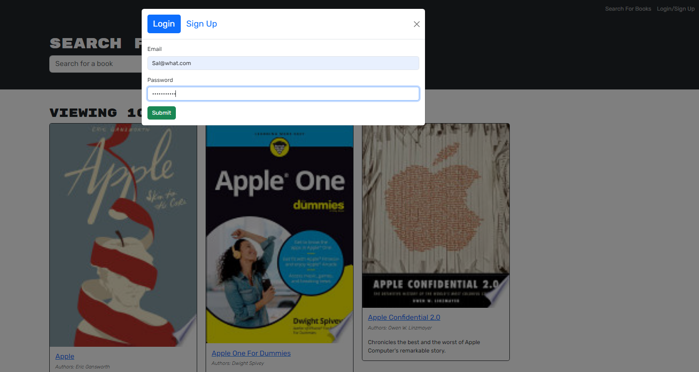
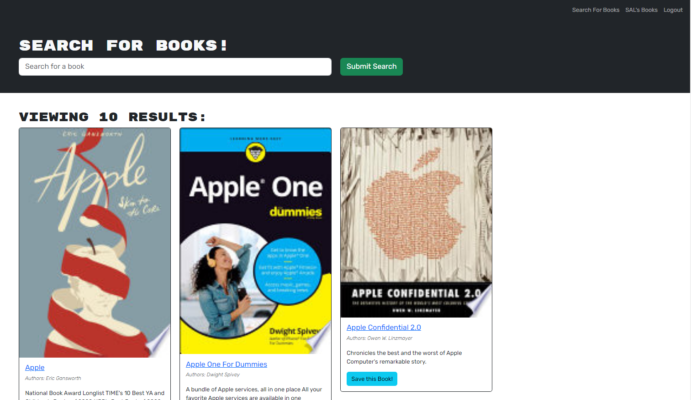
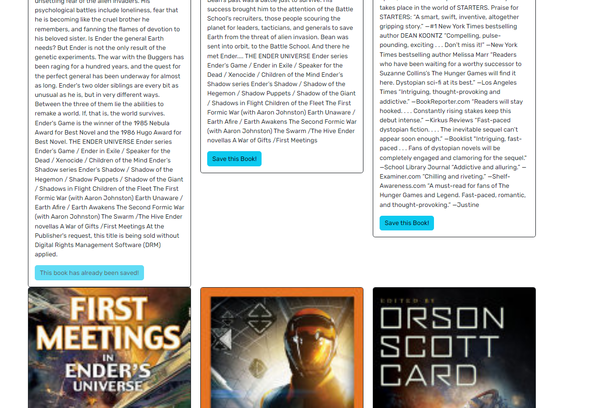

# BookSeekers
  [![license-shield]][license-url]

## Description
This application is a customizeable Google Books API search engine catering to user's preferences of their saved books. Built using the MERN stack, Graphql API and Apollo Server, the app personalizes and stores data to the user's needs. User can login or signup if new the application and from there, the book searches provided can be saved to their account and accessed under their books page. Applying to a live build of this application, the Render platform was used as well as MongoDB Atlas to deploy the database environment on the cloud.

## Table of Contents
  
- [Usage](#usage)
- [Screenshots](#screenshots)
- [Installation](#installation)
- [License](#license)
- [Contributing](#contributing)
- [Questions](#questions)

## Usage
  
[Live Render URL: https://bookseekers.onrender.com/](https://bookseekers.onrender.com/)

<a href='#bookseekers'>back to top</a>

## Screenshots

<a href='#bookseekers'>back to top</a>

## Installation

- To run this project locally, follow these steps:

1. Clone the repository: 

        "$ git clone https://github.com/FractalIceCream/BookSeekers.git"

2. "npm install" from root directory (install packages for both client and server directories as well)

3. "npm run render-build" or "npm run develop" for developer mode

## License
  
This project is licensed under the [MIT License](https://choosealicense.com/licenses/mit)

<a href='#bookseekers'>back to top</a>

## How to Contribute
  
Contribute as needed by forking the repo and making a pull request.
  

<a href='#bookseekers'>back to top</a>

## Questions

[FractalIceCream's GitHub](https://github.com/FractalIceCream)

If you have any questions or feedback, reach me @ [vroco86@gmail.com](mailto:vroco86@gmail.com).

<a href='#bookseekers'>back to top</a>

[license-shield]: https://img.shields.io/badge/LICENSE-MIT-green
[license-url]: https://choosealicense.com/licenses/mit
